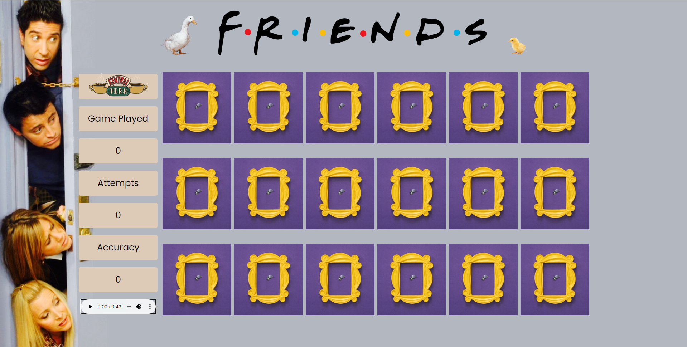

# Memory Match: Friends Edition

## Technologies Used
- CSS3
- CSS Grid
- DOM Creation
- HTML5
- JavaScript ES6

## Live Demo
Live Demo Link: https://joanna-pham.github.io/memory-match/

## Preview


## Features
- User can view the game
- User can select cards to flip
- User can match two cards
- User can win the game
- User can view their stats

## Getting Started

Clone the repository.

```shell
git clone https://github.com/joanna-pham/memory-match.git
cd friends-memory-match
```
